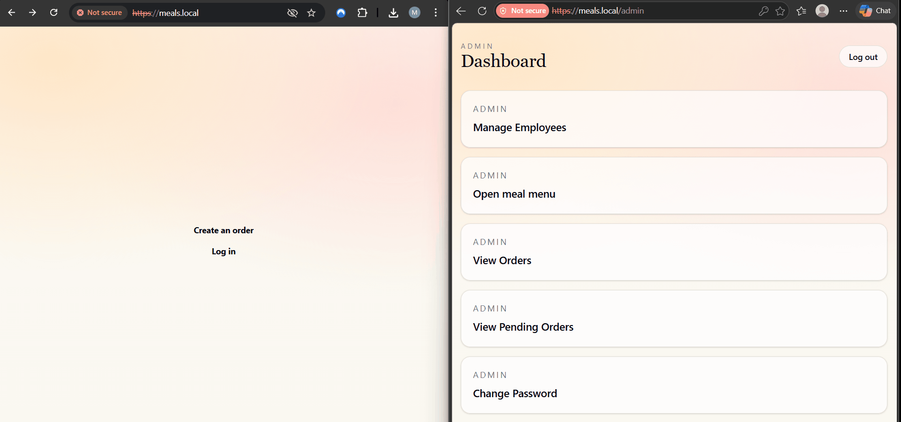
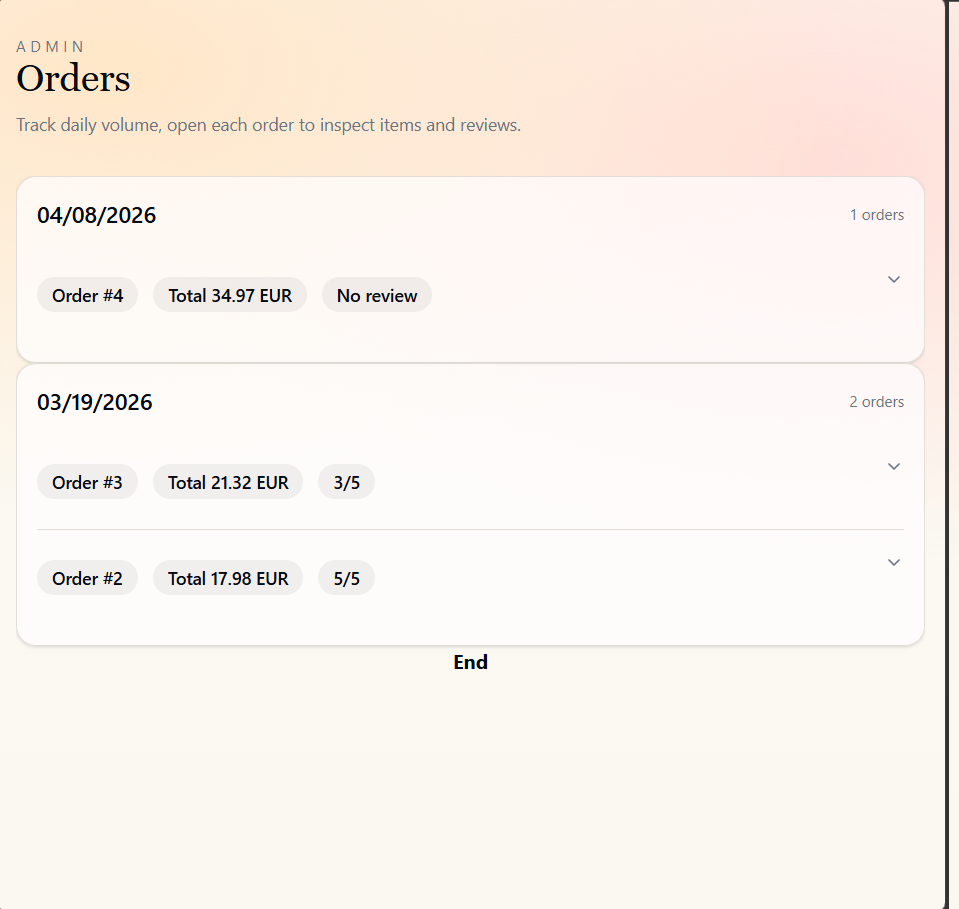
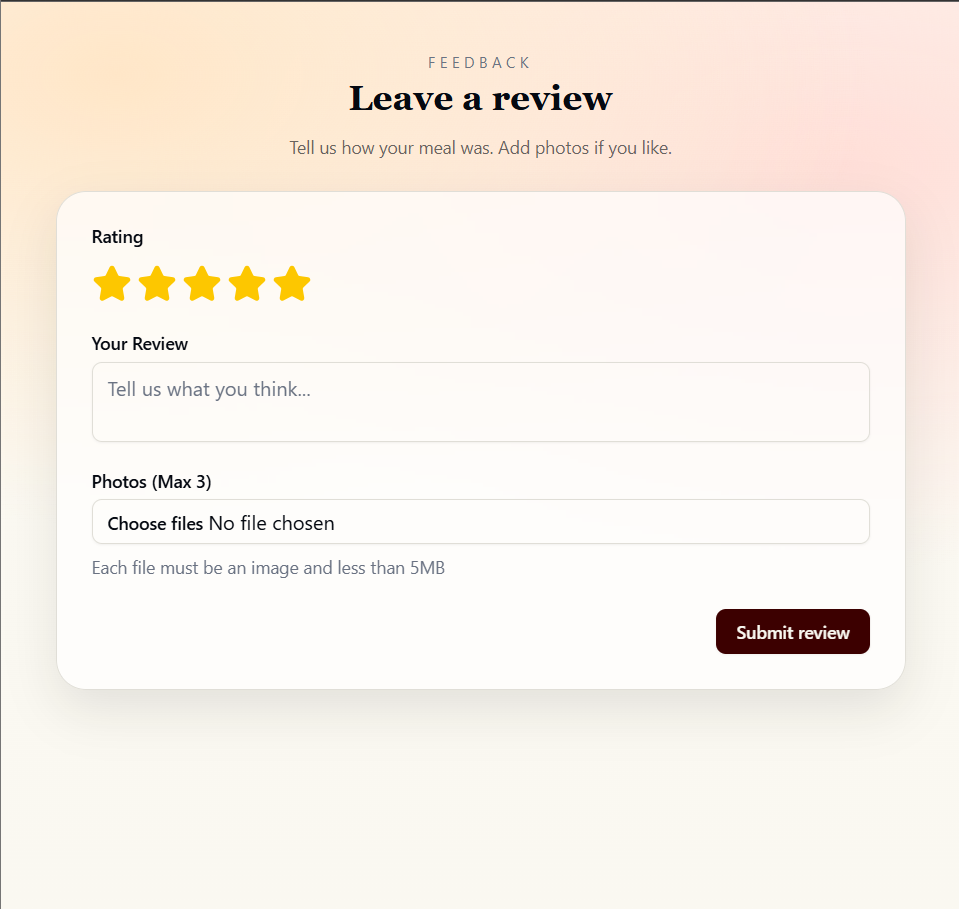

# MyMeals

MyMeals is a full-stack restaurant ordering platform built to solve a practical operational problem: let guests order from the table while staff and managers keep a live view of what needs attention.

This repository is the project hub. It ties together the Go API, the React frontend, and the Docker-based local environment.



## Highlights

- Role-based flows for customers, staff, and admins
- Real-time pending order updates for staff via Server-Sent Events
- Image-backed meal management with Cloudinary integration
- Dockerized local setup with reverse proxy and Postgres
- Split into focused backend and frontend codebases with clean responsibilities

## Use cases

- Guests can browse the menu, place an order, add more meals later, and leave a review
- Staff can monitor incoming work in real time and update order item status
- Admins can manage meals, review orders, and create or remove employee accounts
- Authentication and authorization are enforced in the API with role-aware middleware

## Screenshots

| Orders | Reviews |
| --- | --- |
|  |  |

## Tech Stack

**Backend**

- Go
- Gin
- PostgreSQL
- JWT auth
- Server-Sent Events
- Cloudinary image storage

**Frontend**

- React 19
- TypeScript
- Vite
- TanStack Query
- Zustand
- React Hook Form + Zod
- Tailwind CSS

**Infrastructure**

- Docker Compose
- Caddy reverse proxy

## Repository Structure

- `MyMeals/` Go backend API
- `Mymealsfe/` React frontend
- `demo/` README media assets
- `docker-compose.yml` local full-stack environment

## Architecture

The frontend talks to the backend through a relative `/api` base path. In local frontend development, Vite proxies `/api` to `http://localhost:8080`. In the Docker setup, Caddy serves the frontend and reverse-proxies API traffic to the Go service. PostgreSQL persists application data, and Cloudinary handles image uploads for meals.

## Run Locally With Docker

1. Initialize submodules:
   ```bash
   git submodule update --init --recursive
   ```
2. Create a root `.env` if you want to override defaults used by `docker-compose.yml`.
3. Ensure the backend has the required environment values available, especially `CLOUDINARY_URL`.
4. Add this hosts entry on Windows:
   ```txt
   127.0.0.1 meals.local
   ```
5. Start the stack:
   ```bash
   docker compose up --build
   ```
6. Open `http://meals.local`.

## Local Development

**Backend**

1. Create `MyMeals/.env` using the variables described in [MyMeals/README.md](MyMeals/README.md)
2. Start Postgres
3. Run:
   ```bash
   cd MyMeals
   go run ./cmd
   ```

**Frontend**

1. Install dependencies:
   ```bash
   cd Mymealsfe
   npm ci
   ```
2. Start Vite:
   ```bash
   npm run dev
   ```
3. Open the Vite URL and make sure the backend is running on `http://localhost:8080`

## Demo Credentials

The backend creates a default admin account at startup unless overridden:

- `admin` / `password`

## Related Repositories

- Backend: `https://github.com/Ruclo/MyMeals`
- Frontend: `https://github.com/Ruclo/Mymealsfe`

